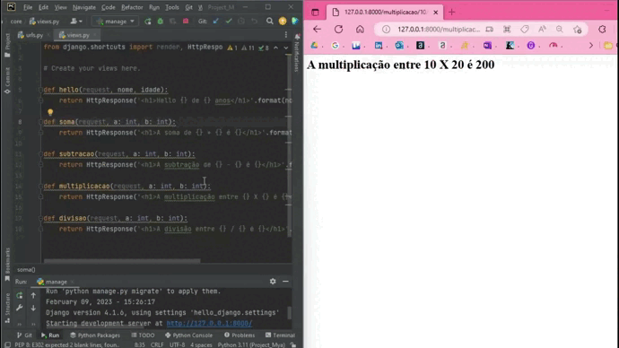

<h1 align="center"> Primeiro Projeto com Danjo </h1>

 

---

Projeto desenvolvido com Django e Pyhton. 

 

  <a href="#-tecnologias">Tecnologias</a>&nbsp;&nbsp;&nbsp;|&nbsp;&nbsp;&nbsp; 
  <a href="#-projeto">Projeto</a>&nbsp;&nbsp;&nbsp;|&nbsp;&nbsp;&nbsp; 
  <a href="#-gif">Gif</a>&nbsp;&nbsp;&nbsp;&nbsp;&nbsp;&nbsp; 

 

  
Introdução ao mundo Django. 

 

## 🚀 Tecnologias

Esse projeto foi desenvolvido com as seguintes tecnologias:
- Django
- Python
- Git e Github

 

## 💻 Projeto

Para a uso desse projeto utilizar o venv.

 

## 📸 Gif

  </img>

 

---

Feito com ♥ by Thamyres Cavalcante.
